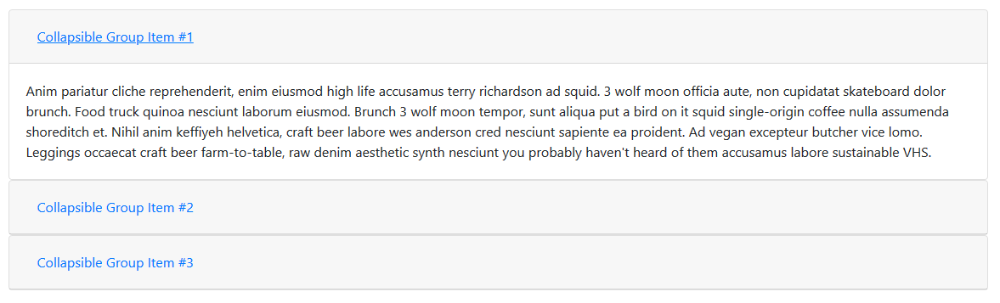

# coding dojo accordion

### create an accordion
- per default every accordion is collapsed
- accordion has three tabs
- every tab close when next tab is opened

### Layout 


## Project setup
```
npm install
```

### Compiles and hot-reloads for development
```
npm run serve
```