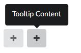

# Welcome to Dojo

### Tooltip
Bei Hover / Touch auf das Icon mit Text soll ein Tooltip erscheinen, in dem weiterer Inhalt angezeigt wird (z.B. Aufzählung von Skills oder Hobbies).

Ein Dreieck zeigt als Indikator den Ursprung des Tooltips. Die Ausrichtung des Tooltips kann dabei variieren (oben, rechts, links oder unten).
Hinweis: Die Positionierung muss nicht während der Laufzeit passieren, z.B. aufgrund des verfügbaren Platzes. Die Ausrichtung kann z.B. per Klasse im Markup gesetzt werden.

